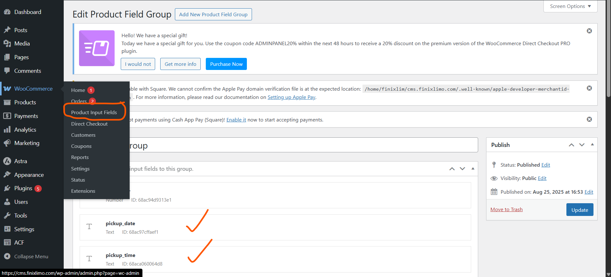

# Next.js + WordPress + WooCommerce Integration Project

This project demonstrates how to connect WordPress with Next.js while using WooCommerce as the e-commerce store. The goal is to manage products, orders, and custom fields directly in WordPress (via WooCommerce), while keeping the main application in Next.js.

## What you’ll learn in this project:
- How to use the WooCommerce API to manage WooCommerce data from WordPress.
- How to create and manage custom product fields in WooCommerce.
- How to fetch and display custom product fields in your Next.js application.

## Key technologies:
- GraphQL – for querying WordPress/WooCommerce data.
- MobX – for state management in Next.js.

## WordPress plugins used:
- Advanced Product Fields (Product Addons) for WooCommerce – by StudioWombat.
- Advanced Custom Fields (ACF) – by WP Engine.
- WooCommerce – by Automattic.
- WooCommerce Direct Checkout – by QuadLayers.

## Wordpress Configuration:
- Copy the code from `enable-restapi-function.php` and paste it into your theme’s functions.php file (via the Theme File Editor).
- Install the recommended plugins listed above.
- After installing **Advanced Product Fields**, you’ll see a new option in your WordPress dashboard inside the **Woocommerce Menu** where you can create additional product fields. (⚠️ This plugin is highly recommended, otherwise your custom fields will not be visible in the Orders list.)

## Nextjs Configuration
- Generate a Consumer Key and Consumer Secret from:
    WooCommerce → Settings → Advanced → REST API

## GraphQl Queries
- http://localhost:3000/api/graphql
- This project uses Nexus to build GraphQL APIs. Navigate to apps/web/graphql/types to find the type definitions.